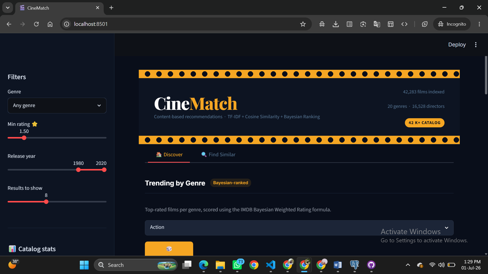

# 🎬 CineMatch — Movie Recommendation Engine

> **Content-based filtering · Hybrid TF-IDF + Bayesian Ranking · 42,000+ titles**

## 🔴 Live Demo → [https://cinematch-engine.streamlit.app/]



---

## What it does

CineMatch recommends movies similar to one you already like. It doesn't need user ratings or watch history — it understands each film through its genres, director, cast, keywords, and plot overview, then finds the closest matches using cosine similarity on a weighted TF-IDF vector space.

Results are re-ranked using a **hybrid score** that blends content similarity with the IMDB Bayesian Weighted Rating formula — so you get films that are both thematically close *and* genuinely well-regarded, not just obscure textual matches.

---

## Features

**Discover tab**
- Trending movies by genre, ranked by Bayesian weighted rating
- 🎲 Surprise Me — picks a random film from the selected genre
- Covers 20+ genres across a 42,000-title catalog

**Find Similar tab**
- Search-as-you-type title picker
- Hybrid content + quality recommendations
- Visual match score bars and rating bars per result
- "Why recommended" explanation (shared genre, same director)
- Director filmography section — more films from the same director
- Expandable full results table with sortable columns
- YouTube trailer link per result

**Sidebar**
- Genre, minimum rating, release year, and result count filters
- Live catalog stats (total films, genres, directors, decade breakdown)
- Recently Viewed session history

---

## How it works

### 1 — Dataset merge (`merge_datasets.py`)
Combines two Kaggle datasets:
- **TMDB 5000 Movie Dataset** (~4,800 titles, high-quality metadata)
- **The Movies Dataset** by rounakbanik (~45,000 titles)

Deduplicates on (title, release year), preferring the TMDB 5000 row on conflicts. Applies a quality filter (minimum overview length, non-empty genres). Final output: **42,283 unique films**.

### 2 — Feature engineering and model build (`build_model.py`)

Each movie is represented as a weighted "tags" string:

| Signal | Weight | Reason |
|---|---|---|
| Director | 4× | Strongest stylistic signal |
| Genres | 4× | Primary category match |
| Keywords | 3× | Thematic fingerprint |
| Cast | 2× | Secondary signal |
| Overview | 1× | Context, not identity |

Repeating tokens N times before TF-IDF is a simple, effective way to encode importance — no custom vectorizer needed.

PorterStemmer normalises word forms (e.g. "running" → "run") before vectorization.

**TF-IDF settings:** `max_features=15,000 · ngram_range=(1,2) · min_df=2 · sublinear_tf=True`
The matrix is kept **sparse** (42,283 × 15,000, ~1.5M non-zero entries) — no dense N×N similarity matrix is ever precomputed or stored.

**Bayesian Weighted Rating** (IMDB formula):

```
WR = (v / (v + m)) × R + (m / (v + m)) × C
```

Where `v` = vote count, `m` = 70th-percentile vote threshold, `R` = film rating, `C` = global mean rating. Normalised 0–1 across the catalog.

Five pickle artifacts are saved:

| Artifact | Contents |
|---|---|
| `movie_list.pkl` | Cleaned DataFrame with all display metadata + Bayesian scores |
| `vectors.pkl` | Sparse TF-IDF matrix |
| `tfidf.pkl` | Fitted TfidfVectorizer |
| `genre_top.pkl` | `{genre: [top-12 movie dicts]}` for the Discover tab |
| `director_map.pkl` | `{director: [movie dicts]}` for filmography section |

### 3 — Inference (`app.py`)

For a query title, cosine similarity is computed **on the fly**:

```python
sims = cosine_similarity(vectors[query_idx], vectors).flatten()
```

No precomputed N×N matrix — memory stays flat regardless of catalog size.

**Hybrid score:**

```python
final_score = 0.65 × cosine_similarity + 0.35 × bayesian_wr_norm
```

Results are filtered by genre, minimum rating, and year range before display.

---

## Project structure

```
movie-recommendation-engine/
├── app.py                  # Streamlit web app (785 lines)
├── build_model.py          # Offline feature engineering + vectorization
├── merge_datasets.py       # Dataset merge and dedup pipeline
├── requirements.txt
├── .gitignore
├── movie_list.pkl          # Precomputed — 44 MB
├── vectors.pkl             # Precomputed — 17 MB
├── tfidf.pkl               # Precomputed — 0.6 MB
├── genre_top.pkl           # Precomputed — small
├── director_map.pkl        # Precomputed — small
└── data/                   # Not committed — download from Kaggle
    ├── tmdb_5000_movies.csv
    ├── tmdb_5000_credits.csv
    ├── movies_metadata.csv
    ├── credits.csv
    └── keywords.csv
```

---

## Local setup

```bash
git clone https://github.com/YOUR_USERNAME/movie-recommendation-engine
cd movie-recommendation-engine
python -m venv venv
source venv/bin/activate        # Windows: venv\Scripts\activate
pip install -r requirements.txt
```

The pickle files are committed, so you can run the app immediately:

```bash
streamlit run app.py
```

To rebuild from raw data (to change weights, filters, or feature logic):

1. Download datasets from Kaggle into `data/`:
   - [TMDB 5000 Movie Dataset](https://www.kaggle.com/datasets/tmdb/tmdb-movie-metadata) → `tmdb_5000_movies.csv`, `tmdb_5000_credits.csv`
   - [The Movies Dataset](https://www.kaggle.com/datasets/rounakbanik/the-movies-dataset) → `movies_metadata.csv`, `credits.csv`, `keywords.csv`

2. Run the pipeline:
```bash
python merge_datasets.py   # produces data/merged_raw.csv
python build_model.py      # rebuilds all 5 pkl artifacts
streamlit run app.py
```

---

## Tech stack

| Layer | Tools |
|---|---|
| Data wrangling | `pandas` `numpy` |
| NLP / ML | `scikit-learn` `nltk` `scipy` |
| Web app | `streamlit` |


---

## Possible extensions

- **Collaborative filtering** — add user rating data to blend content + CF signals
- **Approximate nearest neighbours** — `sklearn.neighbors.NearestNeighbors` with cosine metric for catalogs beyond 100k
- **Sentence embeddings** — replace TF-IDF with SBERT/MiniLM for semantic similarity
- **User accounts** — persist viewing history and build a taste profile across sessions
- **TMDB posters** — set `TMDB_API_KEY` environment variable for live poster images


## Author

**Aiman Hafeez** — BS Computer Science, Begum Nusrat Bhutto Women University, Sukkur
